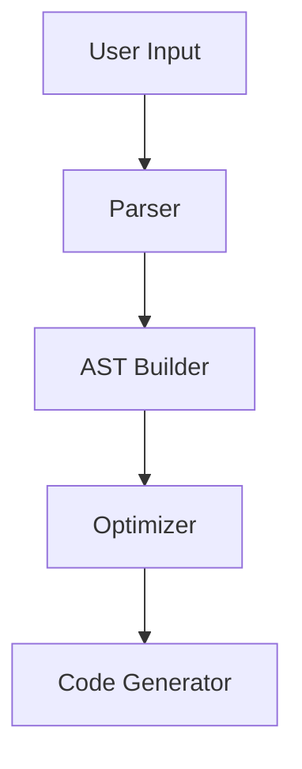

# DSA Project Portfolio Guide

Build an impressive portfolio that demonstrates your mastery of data structures and algorithms.

---

## Why a DSA Portfolio Matters

- **Interviews:** Show practical application beyond whiteboard coding
- **Credibility:** Prove you can build real systems, not just solve puzzles
- **Learning:** Deep understanding comes from implementation
- **Differentiation:** Stand out from other candidates

---

## Portfolio Structure

### Recommended GitHub Layout

```
dsa-portfolio/
├── README.md                    # Overview of all projects
├── 01-todo-list/               # Beginner
│   ├── README.md
│   ├── src/
│   ├── tests/
│   └── docs/
├── 02-contact-book/
├── ...
├── 31-database-engine/         # Advanced
├── visuals/                    # Portfolio screenshots/GIFs
└── docs/
    ├── complexity-analysis.md
    └── architecture-decisions.md
```

### Each Project Should Include

1. **Clear README** with:
   - Project description
   - Key concepts demonstrated
   - How to run the project
   - Complexity analysis (Big O)
   - Screenshots/demo GIF

2. **Clean Code** with:
   - Consistent style
   - Meaningful variable names
   - DRY principles
   - Single responsibility

3. **Tests** covering:
   - Edge cases
   - Error handling
   - Performance benchmarks

4. **Documentation** explaining:
   - Design decisions
   - Trade-offs considered
   - What you learned

---

## Portfolio Tiers

### Tier 1: Foundation (3-5 Projects)
Show you understand basic data structures.

| Project | Demonstrates |
|---------|--------------|
| LRU Cache | Hash Maps + Doubly Linked Lists |
| Expression Parser | Stacks + String Processing |
| Spell Checker | Tries + Edit Distance |
| Graph BFS/DFS Visualizer | Graph Traversal |
| Sorting Algorithm Visualizer | Sorting + Animation |

### Tier 2: Applied (5-8 Projects)
Show you can combine concepts.

| Project | Demonstrates |
|---------|--------------|
| Autocomplete Engine | Tries + Ranking |
| Pathfinding Visualizer | Graphs + A* + Heaps |
| Huffman Compressor | Trees + Greedy + PQ |
| Social Network Analyzer | Graphs + BFS + Components |
| Task Scheduler | Heaps + Greedy + OOP |

### Tier 3: Systems (3-5 Projects)
Show you can build complex systems.

| Project | Demonstrates |
|---------|--------------|
| In-Memory Database | B-Trees + Disk I/O + SQL |
| Distributed Cache | Hashing + Consistency + Networking |
| Search Engine | Inverted Index + Ranking + Scale |
| Compiler Frontend | Parsers + ASTs + Stacks |
| Real-Time Analytics | Sliding Window + Streams + Heaps |

---

## Writing Project READMEs

### Template

```markdown
# Project Name

One-line description of what this does.

## Key Concepts
- Data Structure 1: How you used it
- Algorithm 2: Why you chose it

## Demo


## Architecture
Brief description of the design.

## Complexity Analysis
| Operation | Time | Space |
|-----------|------|-------|
| Insert    | O(1) | O(n)  |
| Search    | O(lg n) | O(1) |
| Delete    | O(lg n) | O(1) |

## Design Decisions
Why you made certain choices.

## What I Learned
Key takeaways from this project.

## Running the Project
Step-by-step instructions.

## Future Improvements
What you'd add with more time.
```

---

## Complexity Analysis Template

Always include Big O analysis in your projects:

```markdown
## Algorithm Analysis

### Approach 1: Brute Force
- Time Complexity: O(n²)
- Space Complexity: O(1)
- Description: Check every pair

### Approach 2: Hash Map
- Time Complexity: O(n)
- Space Complexity: O(n)
- Description: Use hash map for O(1) lookups

### Approach 3: Optimized
- Time Complexity: O(n log n)
- Space Complexity: O(1)
- Description: Sort then two-pointer scan
```

---

## Visual Presentation

### Create Demo GIFs
Tools: LICEcap, GIPHY Capture, asciinema (terminal)

### Screenshots
- Show the algorithm in action
- Highlight key states
- Compare before/after

### Architecture Diagrams
Tools: Mermaid, Draw.io, Excalidraw



---

## Showcasing Your Work

### GitHub Profile
- Pin your best 6 repositories
- Write a compelling bio mentioning DSA
- Use consistent README formatting

### Personal Website
- Host a portfolio page
- Include live demos where possible
- Write blog posts about learnings

### LinkedIn
- Feature projects in experience section
- Write posts about building projects
- Share complexity analysis insights

---

## Measuring Portfolio Impact

### Metrics to Track
- GitHub stars and forks
- LinkedIn post views
- Interview callback rate
- recruiter inquiries

### Continuous Improvement
1. Add new projects regularly
2. Update existing projects with new insights
3. Refactor code as you learn better patterns
4. Respond to issues and pull requests
5. Write follow-up blog posts

---

## Common Mistakes to Avoid

1. **Too many toy projects** - Quality over quantity
2. **No documentation** - READMEs are essential
3. **No tests** - Shows lack of rigor
4. **Copy-paste without understanding** - Be ready to explain every line
5. **No complexity analysis** - This is DSA, show the math
6. **Ignoring code quality** - Clean code matters
7. **No demo** - Hard for others to evaluate
8. **Abandoned projects** - Finish what you start

---

## Portfolio Timeline

| Week | Focus |
|------|-------|
| 1-2 | 3 beginner projects with full documentation |
| 3-4 | 2 intermediate projects combining concepts |
| 5-6 | 1 advanced project with complex data structures |
| 7-8 | Polish, add tests, create demos |
| 9-10 | Write blog posts, update LinkedIn |
| Ongoing | Add 1 new project per month |
